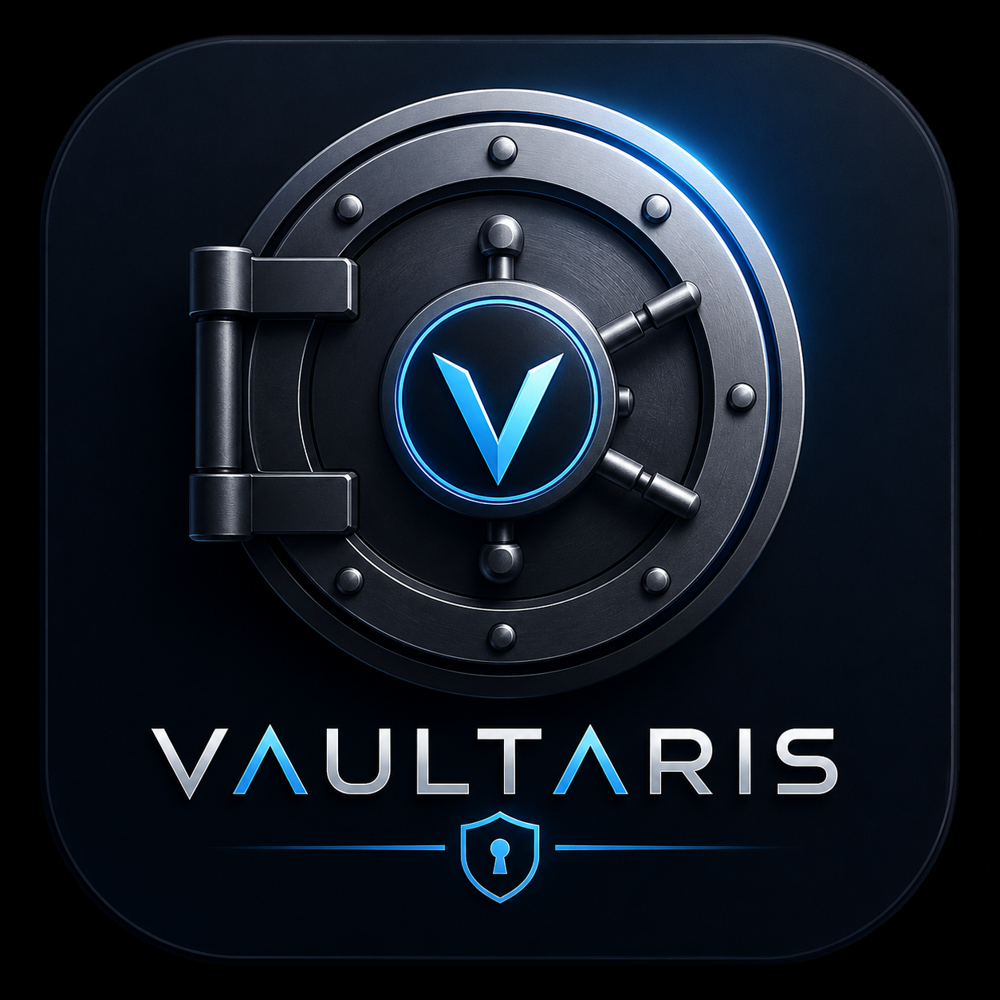

# Vaultaris

<p align="center">
  
</p>

<p align="center">
  A local, offline password manager built with Python and PyQt6.<br>
  All vault data is encrypted with AES-256-GCM and keys are derived using Argon2id — nothing leaves your machine.
</p>

---

## Download

Go to the [Releases](../../releases) page and grab the build for your platform:

| Platform | File |
|----------|------|
| Windows 10/11 | `Vaultaris-windows.exe` |
| Linux (x86_64) | `Vaultaris-linux.tar.gz` |
| macOS (Apple Silicon) | `Vaultaris-macos.tar.gz` |

No Python installation required — each release is a self-contained executable.

---

## Features

- **Multi-type vault items** — passwords, secure notes, credit cards, identities, Wi-Fi credentials, software licenses, crypto seed phrases, and fully custom templates
- **AES-256-GCM encryption** with Argon2id key derivation (64 MB memory cost, 3 iterations)
- **TOTP / 2FA authenticator** — store and generate time-based one-time passwords inline, with a live countdown bar
- **Password generator** — random character passwords or passphrases, with zxcvbn strength estimation and crack-time display
- **Security audit** — detects weak, reused, and old passwords; integrates with the HaveIBeenPwned API via k-anonymity
- **Import** from CSV, Bitwarden JSON, KeePass KDBX, and 1Password CSV
- **Export** to encrypted `.enc`, plain JSON, or a printable PDF emergency sheet with QR code
- **Multiple vaults** — open and switch between several `.enc` vault files in one session
- **Auto-lock on idle** — configurable timeout (minimum 2 minutes), resets on any mouse or keyboard activity
- **Duress password** — opens a decoy vault when a secondary password is entered
- **Panic shortcut** — clears clipboard and locks the vault instantly (default `Ctrl+Shift+L`)
- **Screen capture blocking** — uses `SetWindowDisplayAffinity` on Windows 10 2004+
- **Themes** — Dark, Light, and Cyber Neon, switchable at runtime with smooth fade transitions

---

## App Icon

Place your icon files in `assets/icons/` before building:

| File | Used for |
|------|----------|
| `assets/icons/app.ico` | Windows executable + taskbar |
| `assets/icons/app.icns` | macOS `.app` bundle |
| `assets/icons/app.png` | Linux + in-app fallback |

The app loads whichever format is present at startup. For the best result on all platforms, provide all three. You can convert a single source image using tools like [ImageMagick](https://imagemagick.org) or online converters:

```bash
# PNG → ICO (Windows, requires ImageMagick)
magick app.png -define icon:auto-resize=256,128,64,48,32,16 app.ico

# PNG → ICNS (macOS)
mkdir app.iconset
sips -z 1024 1024 app.png --out app.iconset/icon_512x512@2x.png
iconutil -c icns app.iconset -o app.icns
```

---

## Running from source

**Requirements:** Python 3.11+

```bash
git clone https://github.com/your-username/vaultaris.git
cd vaultaris
pip install -r requirements.txt
python -m src.main
```

---

## Building locally

```bash
pip install pyinstaller==6.10.0
pyinstaller vaultaris.spec
# Output: dist/Vaultaris  (or dist/Vaultaris.exe on Windows)
```

---

## Project structure

```text
src/
├── main.py                  # Entry point — font loading, icon, theme bootstrap
├── core/
│   ├── crypto.py            # Argon2id key derivation + AES-256-GCM encrypt/decrypt
│   ├── vault.py             # Vault open/create/lock, item serialisation
│   ├── vault_manager.py     # Multi-vault session management
│   ├── generator.py         # Password and passphrase generation
│   ├── totp.py              # TOTP code generation and URI parsing
│   ├── audit.py             # Vault health analysis + HIBP breach check
│   ├── exporters.py         # Export to encrypted JSON, plain JSON, PDF
│   ├── importers.py         # Import from CSV, Bitwarden, KeePass, 1Password
│   ├── idle_detector.py     # Qt event filter for auto-lock on idle
│   └── security_utils.py    # Memory locking, screen capture blocking
├── models/
│   ├── item.py              # Unified Item model (all vault item types)
│   ├── credential.py        # Legacy Credential model (used by importers/exporters)
│   └── vault_meta.py        # Vault file header (salt, verification blob)
├── ui/
│   ├── windows/
│   │   └── main_window.py   # Main application window, sidebar routing
│   ├── widgets/
│   │   ├── animated_stack.py  # Cross-fade page transition widget
│   │   ├── vault_view.py
│   │   ├── generator_widget.py
│   │   ├── totp_widget.py
│   │   ├── audit_widget.py
│   │   ├── import_export_widget.py
│   │   ├── settings_widget.py
│   │   └── sidebar.py
│   ├── dialogs/
│   │   ├── item_dialog.py
│   │   ├── unlock_dialog.py
│   │   ├── generator_dialog.py
│   │   ├── totp_setup_dialog.py
│   │   ├── totp_viewer_dialog.py
│   │   ├── custom_template_dialog.py
│   │   ├── manage_vaults_dialog.py
│   │   ├── audit_dialog.py
│   │   ├── import_dialog.py
│   │   ├── export_dialog.py
│   │   └── settings_dialog.py
│   └── themes/
│       └── theme_manager.py   # Dark / Light / Cyber QSS stylesheets
└── utils/
    ├── config.py              # JSON config (~/.vaultaris_config.json)
    └── security_utils.py      # Platform security helpers
assets/
├── fonts/
│   └── MaterialIcons-Regular.ttf
└── icons/
    ├── app.ico                # Windows icon
    ├── app.icns               # macOS icon
    └── app.png                # Linux / fallback icon
```

---

## Vault file format

Each `.enc` file contains three lines:

1. **JSON metadata** — Pydantic `VaultMeta` with base64-encoded Argon2id salt and an AES-GCM verification blob
2. **Base64 nonce** — 12-byte GCM nonce for the item payload
3. **Base64 ciphertext** — AES-256-GCM encrypted JSON array of vault items

The master password is never stored. The verification blob is decrypted on unlock to confirm the password before loading items.

---

## Configuration

Settings are stored in `~/.vaultaris_config.json`. Key options:

| Key | Default | Description |
|-----|---------|-------------|
| `idle_timeout_minutes` | `5` | Minutes of inactivity before auto-lock |
| `lock_on_idle` | `true` | Enable auto-lock |
| `block_screen_capture` | `true` | Block screen capture on Windows |
| `duress_enabled` | `false` | Enable duress password |
| `duress_password` | `""` | Password that opens the decoy vault |
| `decoy_vault_path` | `""` | Path to the decoy `.enc` vault |
| `panic_shortcut` | `"Ctrl+Shift+L"` | Shortcut to lock and clear clipboard |
| `theme` | `"dark"` | UI theme: `dark`, `light`, or `cyber` |

---

## Dependencies

| Package | Purpose |
|---------|---------|
| PyQt6 | GUI framework |
| cryptography | AES-256-GCM encryption |
| argon2-cffi | Argon2id key derivation |
| pydantic | Data validation and serialisation |
| pyotp | TOTP code generation |
| zxcvbn | Password strength estimation |
| requests | HIBP breach API calls |
| fpdf2 | PDF emergency sheet export |
| qrcode + Pillow | QR code generation for PDF export |
| pykeepass | KeePass KDBX import |

---

## License

This project is licensed under the Apache License 2.0 - see the [LICENSE](LICENSE) file for details.